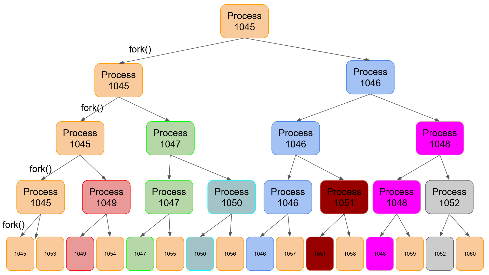

# C Langage

## Table of Contents

- [Introduction](#introduction)
- [Advantages and Disadvantages of the C language](#advantages-and-disadvantages-of-the-c-language)
- [Compile and Run](#compile-and-run)
- [Basic Types in C](#basic-types-in-c)
- [Basic Libraries in C](#basic-libraries-in-c)
- [Structure of a C Project](#structure-of-a-c-project)
    - [Simple file project](#simple-file-project)
- [String Handling](#string-handling)
- [Inbuilt Typecast](#inbuilt-typecast)
- [Operators](#operators)
- [Pointers](#pointers)
- [User Input](#user-input)
- [File Operations](#file-operations)
- [Errors](#errors)
- [Processes](#processes)
- [Positional Parameters](#positional-parameters)
- [Call another Program](#call-another-program)
- [Signal Handling](#signal-handling)
- [Threads VS Processes](#threads-vs-processes)
    - [Main differeces](#main-differences)
    - [Usage](#usage)
- [Threads](#threads)
- [Mutex](#mutex)
- [Semaphore](#semaphore)

## Introduction

The **C langage** is the direct evolution of the **B langage** created in 1969 by Kenneth Thompson. The **C langage** was born in 1972 alongside the development of *UNIX systems*. It was created by Kenneth Thompson and Dennis Ritchie. It is a basic language common to Windows, Linux and Mac Operating systems.

## Advantages and Disadvantages of the C language

|        **Advantages**       |           **Disadvantages**          |
|:---------------------------:|:------------------------------------:|
| Very powerful and efficient |       No implementation of OOP       |
|       Portable langage      |      Lack of exception handling      |
|     Middle level langage    |       Low level of abstraction       |
|      System Programming     |          Difficult to master         |
|    Allows memory handling   | Available libraries depend on the OS |

## Compile and Run

### Commands

Compile a C file into an executable program
```bash
gcc file.c -o output-file-name
```

Compile and display all Warnings
```bash
gcc -Wall file.c -o output-file-name
```

Convert a C file into an Assembly file
```bash
gcc -S file.c
```

Run a C program
```bash
./output-file-name
```

### Compilation Process


## Basic Types in C

|  Type  |                               Description                              | Flag |
|:------:|:----------------------------------------------------------------------:|:----:|
|  char  |        Smaller machine unit. It can contains single characters.        |  %c  |
|   int  | Integer (values depends on processor) - bigger than or equals to short |  %d  |
|  short |                  Integer (values depends on processor)                 |  %i  |
|  long  |              Integer from -2 147 483 647 to 2 147 483 647              |  %ld |
|  float |                 Non-integer numbers (single precision)                 |  %f  |
| double |                 Non-integer numbers (double precision)                 |  %lf |

- *string* is not a basic type (it is a chain of *char*). However, it has its own flag: `%s`.

Define a constant
```c
#define MAX_VALUE 3
```
Please note there is no `;` at the end of this line.

## Basic libraries in C

(Mandatory)
- *stdio.h* -> printf, scanf (for user input)
- *stdlib.h* -> memory allocation, basic constants (exit/success), conversions

(Other)
- *string.h* -> strcmp, strlen

## Structure of a C project

### Simple file project

```c
/*
Project: My_Project
Author: Author_Name
*/

#include <stdio.h>
#include <stdlib.h>

// Constant(s)

// Function Declaration(s)

int main(void) {
    return EXIT_SUCCESS;
}
```

## String handling

Turn a character to upper character
```c
char f = 'f';
char F = toupper(f); 
```

Check if 2 strings are equals
```c
strcmp(str1, str2)  // Returns a nonzero value if the strings are different and 0 if they're the same
```

## Inbuilt Typecast

Str -> int
```c
int a = atoi("9081222");
printf("%d\n", a);
// 9081222
```

Int -> Str
```c
int a = 90000;
int convertedStrLength = countDigits(a);
char* convertedStr = (char*)malloc((convertedStrLength+1)*sizeof(int));
sprintf(convertedStr, "%d", a);
convertedStr[convertedStrLength] = '\0';
printf("%s\n", convertedStr);
// 90000

//There is also the function itoa() but it is not part of the standard
```

## Operators

Ternary operator
```c
(expression_to_evaluate) ? result_if_true : result_if_false
```

Incrementation operator
- `(*pt)++`: Increments the value 16 -> 17
- `*(pt++)`: Increments the address and returns the value
- `pt++`: Increments the address but does not return the value

## Pointers

In C there are **pointers** and **values**:

- A **value** is stored in a variable.
- A **pointer** is a variable which **stores the memory address of another variable**. A pointer always has a **type**. For instance, in the following example, we declare a pointer of type *char\**. It stores the memory address of n variables of type **char**.

Declare and initialize an empty pointer:
```c
int* myIntArray = NULL;
```

In C, we use pointers for declaring and using arrays:

Declaration of a char array
```c
char* input = (char*)malloc(sizeof(char)*n);
```

Values:
```c
int age = 10;
printf("%d\n", age);  // value of the variable (10)
printf("%p\n", &age); // address of the variable (0x7ffcc194c56c)
```

Pointers:
```c
int* agePointer = &age;
printf("%d\n", *agePointer);    // value of the pointer (10) 
printf("%p\n", agePointer);     // address of the variable being pointed (0x7ffcc194c56c)
printf("%p\n", &agePointer);    // address of the pointer itself (0x7ffcc194c570)
```

Turn a pointer into a value
```c
int value = *pointer;
```

Turn a value into a pointer
```c
int* pointer = &value;  //On a value, "&" returns the address of the value 
```

## User Input

Empty the buffer
```c
while (getchar() != '\n');   // Empty the buffer (if there are still characters)
```
**Note**: After an input with scanf, don't forget to empty the buffer

Integer Input
```c
int userInput = 0;
scanf("%d", &userInput);
```

## File Operations

Open a file
```c
FILE* fp = fopen("./path/to/file", "r");
```

Easiest way to write to a file/stream:
Format and write an integer to a file
```c
fprintf(fp, "%d\n", 1460);
```

Easiest way to read from a file/stream:
```c
// The function returns 1 if an error occurs
// The result is stored inside the variable number
int number;
fscanf(fp, "%d", &number);
```

Read a single character
```c
getc(fp);
```

Read a line
```c
char* readLine(FILE* fp) {
    char* line = (char*)malloc(sizeof(char));   // We create an array of char of 1 char
    int readCharacter;
    int i = 0;          // We store the current position in the array of char
    while (EOF != (readCharacter = getc(fp))) { // We read char by char until we reach the EOF marker (= End Of File)
        *(ligne + i) = readCharacter;
        i++;
        line = (char*)realloc(line, sizeof(char)*i+1);  // we extend our char array from 1 char
        if (readCharacter == '\n') {    // If char equals '\n', we reach the End of Line
            *(line + i) = '\0';         // We add '\0' to our line. '\0' is the 'End Of String' marker
            break;
        }
    }
    return ligne;
}
```
Please note if we want to read a whole file and return it as a string (= an array of characters). We juste have to modify the previous code by removing the `if (readCharacter == '\n') {...}`. Don't forget to add the End of String marker (`\0`) after building the string.

Write an integer to a file (low-level functions)
```c
int n = 11;
fwrite(&n, sizeof n, 1, fp);

fread()
```

Close a file
```c
fclose()
```

## Errors

Write a message on stderr
```c
perror("An unexpected error has occured");
```
**Note:** `perror` will not exit the program

Exit the program after an error
```c
exit(EXIT_FAILURE);
```

## Processes

### What is it

A **process** is an instance of a program that is being executed by the operating system with its own memory space, resources and execution state.

### Fork

In C, it is possible to use processes to **execute several task in parallel/simultaenously**. 

Be really careful with processes. Keep in mind that they **do not share a common memory space**. Each process has **its own memory space**. This means that if a child process modifies a global variable, its father WON'T BE ABLE to see the modifications. Here is an example:

A global variable modified by a both a child process and a sigchld handler.
```c
#include<stdio.h>
#include<stdlib.h>
#include<unistd.h>
#include <sys/wait.h>

int num = 18;

void handler(int sig) {
    num /= 2;
}

int main(void) {
    pid_t pid;
    signal(SIGCHLD, handler);
    if ((pid = fork()) == 0) {
        num -= 3;
        exit(0);
    }
    waitpid(pid, NULL, 0);
    printf("num = %d\n", num);  // What will be the value of num here ?
    exit(0);
}
```

In short, each process has its own space, so the child modifies its own version of the global variable `num`. In this space, it is equals to `15`. As it ends, it sends a `SIGCHLD` signal towards its father. The father will catch the signal and execute the associated handler which will divide num by 2. `num` equals `9` now. And finally, the father prints `num = 9`.


To create a new process, we use the `fork()` function. It creates a **copy of the code** (including everything; variables, globals, file descriptors...) 

Libraries used for creating processes
```c
#include <sys/types.h>
#include <unistd.h>
```

Create a new child (do a fork)
```c
pid_t pid = fork(); // returns the PID of the child (Process IDentifier)

// Error while forking
if (pid < 0) {
    perror("An error has occured while forking");
    exit(EXIT_FAILURE);
} else if (pid == 0) {
    // Child action
} else {
    // Father action
}
```

- Fork Error: PID == -1
- Child Process: PID == 0
- Father Process: PID > 0


Look at the following code:
How many times `Hello World!` will be printed?
```c
int main(void) {
    fork();
    fork();
    fork();
    fork();
    printf("Hello World");
}
```
It will be printed 2^n times where n equals the number of written call to the fork function. So here, it will print the result 2^4 = 16 times. 

A fork creates a new process. After the first fork, we have 2 processes 

Here is the view of what happens in the computer:


Get the PID of the current process
```c
getpid()
```

Get the PID of the father of the current process
```c
getppid()
```

Wait for any children
```c
wait(NULL);
```

How does the `wait()` function works?
```c
int exitStatus;
int childPid;

childPid = wait(&exitStatus);

printf("The child process n°%d exited with the value: %d\n", childPid, exitStatus);
// Output: The child process n°1445 exited with the value: 0"
```
The `wait()` function can be used to retrieve the signal send by the process. They are used to **control processes**.


Wait for a specific child
```c
waitpid(543);
```

Execute another program
```c
int main(void) {
    char* path = "./my_program";
    char* argval[] = {"my_program", "param1", "param2", NULL};  // The NULL at the end is mandatory
    execv(path, argval);
    exit(EXIT_SUCCESS);
}
```

### Execution Trace

If our program uses child processes. Each process will be ordered by our **operating system's task scheduler**. Each process will execute its task when allowed by the computer.

Let's say we have two processes

There is basically **no way to know how these processes will be ordered** by the computer. For instance, in the following code, execution resulted in the following trace:

```c
void executionTrace(void) {
    pid_t pid = fork();

    if (pid < 0) {
        perror("Error while doing fork");
        exit(EXIT_FAILURE);
    } else if (pid == 0) {
        printf("X1\n");
        sleep(2);
        printf("X2\n");
    } else {
        printf("Y1\n");
        sleep(2);
        printf("Y2\n");
        exit(EXIT_SUCCESS);
    }

    while(wait(NULL) > 0);
    printf("All processes have ended!\n");
}
```

Result
```bash
Y1
X1
Y2
X2
All processes have ended!
```

## Positional Parameters

It is possible to build scripts with the C langage and to pass parameters at launch:
```c
int main(int argc, char *argv[]) {
  int i;

  printf("Number of arguments: %d\n", argc);
  printf("Arguments:\n");
  for (i = 0; i < argc; i++) {
    printf("%d: %s\n", i, argv[i]);
  }

  return 0;
}
```

## Call another program

Call another c program
```c
int main(int argc, char* argv[]) {
  char *args[] = {"./other_program", "arg1", "arg2", NULL};
  execv("./other_program", args);
  perror("execv failed");
  return 1;
}
```

Call a system command
```c
int main() {
  printf("Running ls command...\n");
  execl("/bin/ls", "ls", "-l", (char *)NULL);
  printf("This line won't be executed if execl() is successful\n");
  return 0;
}

Replace/Transform the current process with another process
```c
int main() {
  char *path = "/bin/ls";
  char *argv[] = {"ls", "-l", NULL};

  if (execlp(path, argv[0], argv[1], (char *) NULL) == -1) {
    perror("execlp failed");
  }

  return 0;
}
```

## Signal Handling

**Signals** are used for asynchronous communication between processes. There is no guarantee that the signal will be received or acted upon by the target process.


Here are some examples:

Signal | Signification | Description
-------|---------------|------------
`SIGINT` | Signal Interrupt | Generated when the user presses `CTRL + C`. Used to interrupt the process and typically cause it to terminate.
`SIGKILL` | Signal Kill | **Cannot be caught, blocked or ignored**, and is used to force a process to terminate immediately.
`SIGTERM` | Signal Terminate | Used to request that a process terminate gracefully, allowing it to clean up resources before exiting.
`SIGSTOP` | Signal Stop | **Cannot be caught, blocked or ignored** and is used to stop a process.
`SIGCONT` | Signal Continue | Used to continue a stopped process.
`SIGABRT` | Signal Abort | Generated by the `abort()` function, it's used to cause an abnormal termination of the process.
`SIGSEGV` | Signal Segmentation Violation | Generated when a process tries to access memory that it's not allowed to, indicates a bug in the process.
`SIGFPE` | Signal Floating-Point Exception | Generated when a process encounters an exceptional arithmetic condition, such as division by zero.
`SIGBUS` | Signal Bus Error | Generated when a process encounters a bus error, typically due to an alignment error or invalid memory access.
`SIGCHLD` | Signal Child Status Changed | Sent to a parent process when a child process terminates or stops. Used to notify the parent of changes in the status of its child processes.
`SIGUSR1` & `SIGUSR2`| Signals Defined by User | A custom signal defined by the user


Send a signal to a given process (kill or custom signal)
```c
kill(PID_TARGET_PROCESS, SIGINT);
```

It is possible to create **signal handlers** which are **functions called when a given signal is received**.

Create a Signal Handler
```c
int main(void) {
    // Declare that the function sigint_handler() is the associated handler for handling the SIGINT signal
    if (signal(SIGINT, sigint_handler) == SIG_ERR)
        printf("An error has occured while handling SIGINT");

    // Execute the default action when SIGTERM is received
    if (signal(SIGTERM, SIG_DFL) == SIG_ERR)
        printf("An error has occured while handling SIGTERM");

    // Ignore SIGUSR1 (= do nothing when SIGUSR1 is received)
    if (signal(SIGUSR1, SIG_IGN) == SIG_ERR)
        printf("An error has occured while handling SIGUSR1");
}

// The Signal Handler itself
void sigint_handler(int signal) {
    printf("I've received the SIGINT signal");
}
```

Suspend the execution of a process until a signal is received.
When a signal is received, the process resumes execution and any signal-catching function associated to the received signal will be executed.
```c
pause();
```

Block a signal until some critical work is executed
```c
sigset_t block_mask, original_mask;
    
// Define the set of signals to block
sigemptyset(&block_mask);
sigaddset(&block_mask, SIGINT);

// Block the signals
if (sigprocmask(SIG_BLOCK, &block_mask, &original_mask) < 0) {
    perror("Unable to block signals");
    return 1;
}

// Do some critical work
sleep(10);

// Restore the original signal mask
if (sigprocmask(SIG_SETMASK, &original_mask, NULL) < 0) {
    perror("Unable to restore original signal mask");
    return 1;
}
```

## Pipes

Pipes are mechanismes used in **inter-process communication** in UNIX-like systems.

There are two types of pipes:
- Named Pipe
- Unnamed Pipe

Pipes are part of the `unistd.h` library.

### Named Pipe

A **named pipe** also known as a **FIFO** is a special type of file that acts as a communication channel between two or more processes.

It has a **name** and can **be opened/closed**.

They are generally used for communication between processes that run on the same system but can be used for communication between processes on different systems.

Important functions
```c
mkfifo()      // Create the named pipe
open()        // Open the named pipe
write()       // Write to the named pipe
read()        // Read from the named pipe
close()       // Close the named pipe
unlink()      // Remove the named pipe
```

An example of usage:
```c
#include <fcntl.h>
#include <stdio.h>
#include <sys/stat.h>
#include <unistd.h>

#define FIFO_NAME "my_fifo"

int main(void) {
    int fd;
    char buf[100];

    // Create the named pipe
    if (mkfifo(FIFO_NAME, 0666) < 0) {
        perror("Unable to create named pipe");
        return 1;
    }

    // Open the named pipe for reading
    if ((fd = open(FIFO_NAME, O_RDONLY)) < 0) {
        perror("Unable to open named pipe");
        return 1;
    }

    // Read from the named pipe
    read(fd, buf, 100);
    printf("Read from named pipe: %s\n", buf);
    close(fd);

    // Remove the named pipe
    unlink(FIFO_NAME);
    return 0;
}
```

### Unnamed Pipe

An **unnamed pipe** is a mechanism for communication between two processes that runs on the same system.

It provides a way to pass data from one process to another without the need of a permanent file.

Additional Note: **Unlike named pipes**, these kind of pipes can only be accessed by the process that created them and they exist only for the duration of the communication. We tend to use them with `fork()`

Important functions
```c
pipe()      // Create the unnamed pipe
write()     // Write to the unnamed pipe
read()      // Read from the unnamed pipe
close()     // Close the unnamed pipe
```

It is possible to communicate from process A to B and from B to A but we need to use two pipes in order to do so.


Example: send a string through a pipe
```c
#include <stdio.h>
#include <unistd.h>

#define R 0     // Read Descriptor Index
#define W 1     // Write Descriptor Index

int main(void) {
    int fd[2];

    // Create the unnamed pipe
    if (pipe(fd) < 0) {
        perror("Unable to create unnamed pipe");
        return 1;
    }

    if (fork() == 0) {
        char* sentence = "Hello World!";
        // Close the Read Part (we don't need it as we write only)
        close(fd[R]);
        write(fd[W], sentence, strlen(sentence) + 1);
        close(fd[W]);
    } else {
        char message[100];
        // Close the Write Part (we don't need it as we read only)
        close(fd[W]);
        int nbBytes = read(fd[R], message, 100);
        printf("Reading %d bytes : %s\n", nbBytes, message);
        close(fd[R]);
    }

    // Close the read end of the unnamed pipe
    close(fd[R]);
    return 0;
}
```

Example2: Send an integer through a pipe
```c
#define R 0
#define W 1

int main(void) {
    int fd[2];

    // Create the unnamed pipe
    if (pipe(fd) < 0) {
        perror("Unable to create unnamed pipe");
        return EXIT_FAILURE;
    }

    if (fork() == 0) {
        int intToSend = 45;
        close(fd[R]);
        write(fd[W], &intToSend, sizeof(int));
        close(fd[W]);
    } else {
        int receivedInt;
        close(fd[W]);
        int nbBytes = read(fd[R], &receivedInt, sizeof(int));
        printf("Reading %d bytes : %d\n", nbBytes, receivedInt);
        close(fd[R]);
    }

    // Close the read end of the unnamed pipe
    close(fd[R]);
    return EXIT_SUCCESS;
}
```

What if I use 3 or more processes?

In this case each pair of process share an **unnamed pipe**.


Here we use an array of file descriptors:
- Each cell of the array contains a file descriptor
- Each file descriptor is composed of two parts (write/read)


**Important Note:** As each process only reads or writes inside a given pipe, remember to close the unused part of the pipe inside the process.

In the following example:
- the 1st process writes 3
- the 2nd process reads 3, adds 3 and write 6
- the last process reads 6, adds 3 and write 9
```c
#define R 0
#define W 1

int main(void) {
    int fd1[2], fd2[2], fd3[2];
    int fd_array[3];
    fd_array[0] = pipe(fd1);
    fd_array[1] = pipe(fd2);
    fd_array[2] = pipe(fd3);

    int pid1 = fork();
    int pid2 = fork();
    
    switch(pid1) {
        case -1:
            perror("An error has occured while forking");
            exit(EXIT_SUCCESS);
        case 0:
            // Get the initial value and add 3
            close(fd1[W]);
            int receivedInt;
            read(fd1[R], &receivedInt, sizeof(int));
            close(fd1[R]);

            receivedInt += 3;

             // Transfer the new value and add 3
            close(fd2[R]);
            write(fd2[W], &receivedInt, sizeof(int));
            close(fd2[W]);

            exit(EXIT_SUCCESS);
        default:
            close(fd1[R]);
            int initialValue = 3;
            write(fd1[W], &initialValue, sizeof(int));
            close(fd1[W]);
            
    }

    switch(pid2) {
        case -1:
            perror("An error has occured while forking");
            exit(EXIT_SUCCESS);
        case 0:
            // Get the initial value and add 3
            close(fd2[W]);
            int receivedInt2;
            read(fd2[R], &receivedInt2, sizeof(int));
            close(fd2[R]);

            receivedInt2 += 3;

             // Transfer the new value and add 3
            close(fd3[R]);
            write(fd3[W], &receivedInt2, sizeof(int));
            close(fd3[W]);

            exit(EXIT_SUCCESS);
        default:
            close(fd3[W]);
            int receivedInt3;
            read(fd3[R], &receivedInt3, sizeof(int));
            close(fd3[R]);
            printf("%d", receivedInt3);
    }
    return EXIT_SUCCESS;
}
```

## Threads VS Processes

### Main differences

A **process** is a task which:
- has its own isolated memory space
- has its own state
- is heavier than a thread
- is slower than a thread
If a process crashes, it **won't affect other processes**.

A **thread** is a task which:
- runs in the same memory space as the parent process
- is lighter than a processes
- is faster than a process
If a thread crashes, it **will affect other threads in the same process or even the entire process**

Thread can communicate and share data more easily with parents. Using thread is also much faster and less resource-intensive for the CPU because it don't have to handle a fully dedicated memory space.

At the CPU level, both threads and processes are executed by the CPU as separate entities and can run simultaneously, allowing the CPU to perform multiple tasks at the same time. The choice between using threads or processes depends on the specific requirements of the task at hand and the trade-offs between speed, isolation, and resource usage.

### Usage

In general, processes are useful when you want to run independent and isolated tasks, while threads are useful when you want to perform multiple tasks within a single process that share data and resources.

Sure! Here are some examples of when you might use threads or processes:

**Processes**:

- Running multiple independent applications, such as a web browser, a text editor, and a music player, all at the same time.
- Running a heavy computational task, such as scientific simulations, that requires a large amount of memory and resources.
- Running a security-sensitive task, such as a virus scanner, in a separate process to prevent any potential errors or security breaches from affecting the rest of the system.

**Threads**:

- Implementing a user interface for a desktop application that needs to be responsive to user interactions while performing background tasks, such as file I/O or network communication.
- Implementing a server that needs to handle multiple clients simultaneously, such as a web server serving multiple clients or a chat server handling multiple users.
- Parallelizing a computationally intensive task, such as image processing or matrix multiplication, by breaking it down into smaller tasks and executing each task on a separate thread.

### In a Nutshell


## Threads

A **thread** is a **small set of instructions designed to be scheduled and executed by the CPU independently of the parent process**.

In order to use **threads**, we need to inform the compiler that we're using them:
```bash
gcc my-prog.c -o my-prog -lpthread
```

You'll also need to include the **threads library**:
```c
#include <pthread.h>
```

Create a thread
```c
pthread_create();
```

Exit a thread
```c
pthread_exit();
```

Wait a thread to finish
```c
pthread_join();
```

Get the Thread ID of the current thread
```c
pthread_self();
```

Make a thread runs independently
```c
pthread_detach();
```

## Mutex

In a **multi-threaded environment**, a **Mutex** (= Mutual Exclusion) is a synchronization primitive (= a safety mechanism) used to ensure that **only one thread can access a given resource at a time**.

Mutex prevents **race conditions** and **data corruption**.

A **mutex** is a `Lock Mechanism`.

Declare a Mutex object (it is always declared as a **global variable**)
```c
pthread_mutex_t lock;
int shared_counter = 0; // Global variable used by n threads
```

Initialize a Mutex
```c
pthread_mutex_init();
```

Lock the Mutex before accessing the shared resource
```c
pthread_mutex_lock();
```

After accessing the shared resource, release the Mutex
```c
pthread_mutex_unlock();
```

Destroy the Mutex when it is no longer needed
```c
pthread_mutex_destroy();
```


Here is a small example of Mutex usage where each thread access a shared variable and increments it:
```c
#include <pthread.h>
#include <stdio.h>
#include <stdlib.h>

pthread_mutex_t lock;
int shared_counter = 0;

void *increment_counter(void *tid) {
  pthread_mutex_lock(&lock);
  shared_counter++;
  printf("Thread ID: %ld, Shared Counter: %d\n", (long)tid, shared_counter);
  pthread_mutex_unlock(&lock);
  pthread_exit(NULL);
}

int main() {
  pthread_t thread1, thread2;
  pthread_mutex_init(&lock, NULL);
  pthread_create(&thread1, NULL, increment_counter, (void *)1);
  pthread_create(&thread2, NULL, increment_counter, (void *)2);
  pthread_join(thread1, NULL);
  pthread_join(thread2, NULL);
  pthread_mutex_destroy(&lock);
  return 0;
}
```

## Semaphore

### Principles

A **semaphore** is a data structure used for**synchronizing access to shared resources** in a concurrent system. It is commonly used in multi-threaded programs.

It ensures that several threads **do not simultaneously access the same shared resource**.

A **semaphore** is a `Signal Mechanism`.

There are two types of semaphores:
- binary semaphore: `0` if **access is authorized** or `1` if **access is restricted**
- counting semaphore: any `positive int`

For a binary semaphore, the initial value is set to `1` when it is created with `sem_init()`. The first thread that calls `sem_wait()` is able to access the resource. Other threads that call `sem_wait()` have to wait until the resource is released by a call to `sem_post()`.

Semaphore functions are located inside the below library:
```c
#include <semaphore.h>
```

Initialize a semaphore
```c
sem_init();
```

Decrement the value of a semaphore (1 -> 0)
```c
sem_wait();
```

Decrement the value of a semaphore only if the value is greater than 0
```c
sem_trywait();
```

Increment the value of a semaphore
```c
sem_post();
```

Retrieve the current value of a semaphore
```c
sem_getvalue();
```

Destroy a semaphore and free the associated resources
```c
sem_destroy();
```

A quick example of semaphore usage
```c
#include <semaphore.h>
#include <pthread.h>
#include <stdio.h>
#include <unistd.h>

sem_t semaphore;
int shared_resource = 0;

void *thread_function(void *arg) {
    int i;

    for (i = 0; i < 5; i++) {
        sem_wait(&semaphore);  // Wait for access to the shared resource
        shared_resource++;  // Use the shared resource
        printf("Thread %d: %d\n", (int)arg, shared_resource);
        sleep(1);
        sem_post(&semaphore);  // Release access to the shared resource
    }

    return NULL;
}

int main() {
    pthread_t thread1, thread2;
    sem_init(&semaphore, 0, 1);  // Initialize the semaphore

    // Create two threads
    pthread_create(&thread1, NULL, thread_function, (void *)1);
    pthread_create(&thread2, NULL, thread_function, (void *)2);

    // Wait for both threads to finish
    pthread_join(thread1, NULL);
    pthread_join(thread2, NULL);

    sem_destroy(&semaphore);  // Clean up the semaphore

    return 0;
}
```

### The Producer-Consumer Problem

This problem is also known as the **bounded-buffer problem**. It is a classic problem in Computer Science. It occurs when **several threads are trying to access a shared buffer which has a limited space**.

In this problem, we have: 
- a **Buffer** (= a memory location which can hold a limited number of items) 
- a **Producer thread** (= writes in the Buffer)
- a **Consumer** (= reads from the Buffer) 

Thr problem occurs when:
- the Producer tries to write in the Buffer which is already full
- the Consumer tries to read from the Buffer which is empty

In C, **semaphores** can be used to solve the problem. They keep track of: 
- **the number of available spaces in the buffer**.
- **the number of items in the buffer**
It ensures that the buffer never becomes **full** or **empty**.

the producer thread writes integer values to a buffer, while the consumer thread reads them. The buffer has a limited size, and we use semaphores full and empty to keep track of the number of full and empty slots in the buffer. The sem_init function initializes the semaphores, with full starting at 0 (no full slots)
```c
#include <stdio.h>
#include <pthread.h>
#include <semaphore.h>
#include <unistd.h>

#define BUFFER_SIZE 10
#define PRODUCER_SLEEP_TIME 2
#define CONSUMER_SLEEP_TIME 1

int buffer[BUFFER_SIZE];
int next_in = 0;
int next_out = 0;

// semaphore to keep track of the number of empty spaces in the buffer
sem_t empty;

// semaphore to keep track of the number of items in the buffer
sem_t full;

// mutex to protect critical section
pthread_mutex_t mutex;

// function to be executed by the producer thread
void *producer(void *arg) {
    for (int i = 0; i < 100; i++) {
        // wait for an empty space in the buffer
        sem_wait(&empty);

        // lock the mutex to protect the critical section
        pthread_mutex_lock(&mutex);

        // write to the buffer
        buffer[next_in] = i;
        next_in = (next_in + 1) % BUFFER_SIZE;

        // unlock the mutex
        pthread_mutex_unlock(&mutex);

        // increase the count of the full semaphore
        sem_post(&full);

        printf("Produced: %d\n", i);
        sleep(PRODUCER_SLEEP_TIME);
    }
    return NULL;
}

// function to be executed by the consumer thread
void *consumer(void *arg) {
    int item;
    for (int i = 0; i < 100; i++) {
        // wait for an item in the buffer
        sem_wait(&full);

        // lock the mutex to protect the critical section
        pthread_mutex_lock(&mutex);

        // read from the buffer
        item = buffer[next_out];
        next_out = (next_out + 1) % BUFFER_SIZE;

        // unlock the mutex
        pthread_mutex_unlock(&mutex);

        // increase the count of the empty semaphore
        sem_post(&empty);

        printf("Consumed: %d\n", item);
        sleep(CONSUMER_SLEEP_TIME);
    }
    return NULL;
}

int main(void) {
    pthread_t producer_thread, producer_thread;

    // initialize the semaphores
    sem_init(&empty, 0, BUFFER_SIZE);
    sem_init(&full, 0, 0);

    // initialize the mutex
    pthread_mutex_init(&mutex, NULL);

    // create the producer and consumer threads
    pthread_create(&producer_thread, NULL, producer, NULL);
    pthread_create(&consumer_thread, NULL, consumer, NULL);

    // wait for the producer and consumer threads to finish
    pthread_join(producer_thread, NULL);
    pthread_join(consumer_thread, NULL);

    return 0;
}
```

The **dining pilosophers** problem is a famous example of the producer-consumer problem.

Philosophers have 3 states:
1. Think
2. Eat
3. Starvation

Semaphores can be used to handle the **deadlock** problem. In order to manage the **starvation** problem, we'll have to use n semaphores (with n = number of philosopers).

- When a philosopher cannot take 2 forks. He goes into his **think state**.
- When a philosopher ends eating, he wakes up his neighbors in **think state**. The neighbors can then eat.

