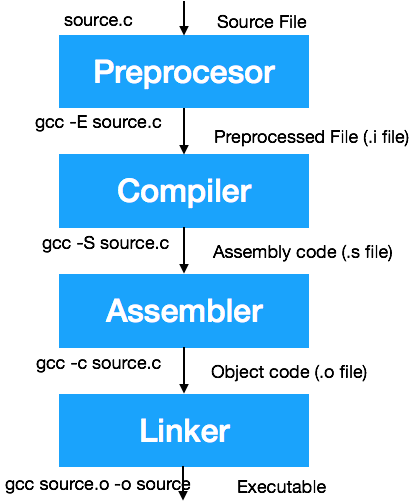

# C Langage

## Table of Contents

- [Introduction](#introduction)
- [Advantages and Disadvantages of the C language](#advantages-and-disadvantages-of-the-c-language)
- [Compile and Run](#compile-and-run)
- [Basic Types in C](#basic-types-in-c)
- [Basic Libraries in C](#basic-libraries-in-c)
- [Structure of a C Project](#structure-of-a-c-project)
    - [Simple file project](#simple-file-project)
- [String Handling](#string-handling)
- [Inbuilt Typecast](#inbuilt-typecast)
- [Operators](#operators)
- [Pointers](#pointers)
- [File Operations](#file-operations)

## Introduction

The **C langage** is the direct evolution of the **B langage** created in 1969 by Kenneth Thompson. The **C langage** was born in 1972 alongside the development of *UNIX systems*. It was created by Kenneth Thompson and Dennis Ritchie. It is a basic language common to Windows, Linux and Mac Operating systems.

## Advantages and Disadvantages of the C language

|        **Advantages**       |           **Disadvantages**          |
|:---------------------------:|:------------------------------------:|
| Very powerful and efficient |       No implementation of OOP       |
|       Portable langage      |      Lack of exception handling      |
|     Middle level langage    |       Low level of abstraction       |
|      System Programming     |          Difficult to master         |
|    Allows memory handling   | Available libraries depend on the OS |

## Compile and Run

### Commands

Compile a C file into an executable program
```bash
gcc file.c -o output-file-name
```

Compile and display all Warnings
```bash
gcc -Wall file.c -o output-file-name
```

Convert a C file into an Assembly file
```bash
gcc -S file.c
```

Run a C program
```bash
./output-file-name
```

### Compilation Process



## Basic Types in C

|  Type  |                               Description                              | Flag |
|:------:|:----------------------------------------------------------------------:|:----:|
|  char  |        Smaller machine unit. It can contains single characters.        |  %c  |
|   int  | Integer (values depends on processor) - bigger than or equals to short |  %d  |
|  short |                  Integer (values depends on processor)                 |  %i  |
|  long  |              Integer from -2 147 483 647 to 2 147 483 647              |  %ld |
|  float |                 Non-integer numbers (single precision)                 |  %f  |
| double |                 Non-integer numbers (double precision)                 |  %lf |

- *string* is not a basic type (it is a chain of *char*). However, it has its own flag: `%s`.

Define a constant
```c
#define MAX_VALUE 3
```
Please note there is no `;` at the end of this line.

## Basic libraries in C

(Mandatory)
- *stdio.h* -> printf, scanf (for user input)
- *stdlib.h* -> memory allocation, basic constants (exit/success), conversions

(Other)
- *string.h* -> strcmp, strlen

## Structure of a C project

### Simple file project

```c
/*
Project: My_Project
Author: Author_Name
*/

#include <stdio.h>
#include <stdlib.h>

// Constant(s)

// Function Declaration(s)

int main(void) {
    return EXIT_SUCCESS;
}
```

## String handling

Check if 2 strings are equals
```c
strcmp(str1, str2)  // Returns a nonzero value if the strings are different and 0 if they're the same
```

## Inbuilt Typecast

Str -> int
```c
int a = atoi("9081222");
printf("%d\n", a);
// 9081222
```

Int -> Str
```c
int a = 90000;
int convertedStrLength = countDigits(a);
char* convertedStr = (char*)malloc((convertedStrLength+1)*sizeof(int));
sprintf(convertedStr, "%d", a);
convertedStr[convertedStrLength] = '\0';
printf("%s\n", convertedStr);
// 90000

//There is also the function itoa() but it is not part of the standard
```

## Operators

Ternary operator
```c
(expression_to_evaluate) ? result_if_true : result_if_false
```

Incrementation operator
- `(*pt)++`: Increments the value 16 -> 17
- `*(pt++)`: Increments the address and returns the value
- `pt++`: Increments the address but does not return the value

## Pointers

A **pointer** is a variable which **stores the memory address of another variable**. A pointer always has a **type**. For instance, in the following example, we declare a pointer of type *char\**. It stores the memory address of n variables of type **char**.

In C, we use pointers for declaring and using arrays:

Declaration of a char array
```c
char* input = (char*)malloc(sizeof(char)*n);
```

## Text Input

After an input with scanf, don't forget to empty the buffer
```c
scanf(...);
while (getchar() != '\n');   // Empty the buffer (if there are still characters)
```

## File Operations

Open a file
```c
FILE* fp = fopen("./path/to/file", "r");
```

Read a single character
```c
getc(fp);
```

Read a line
```c
char* readLine(FILE* fp) {
    char* line = (char*)malloc(sizeof(char));   // We create an array of char of 1 char
    int readCharacter;
    int i = 0;          // We store the current position in the array of char
    while (EOF != (readCharacter = getc(fp))) { // We read char by char until we reach the EOF marker (= End Of File)
        *(ligne + i) = readCharacter;
        i++;
        line = (char*)realloc(line, sizeof(char)*i+1);  // we extend our char array from 1 char
        if (readCharacter == '\n') {    // If char equals '\n', we reach the End of Line
            *(line + i) = '\0';         // We add '\0' to our line. '\0' is the 'End Of String' marker
            break;
        }
    }
    return ligne;
}
```
Please note if we want to read a whole file and return it as a string (= an array of characters). We juste have to modify the previous code by removing the `if (readCharacter == '\n') {...}`. Don't forget to add the End of String marker (`\0`) after building the string.

Format and write an integer to a file
```c
fprintf(fp, "%d\n", 1460);
```

Write an integer to a file (low-level functions)
```c
int n = 11;
fwrite(&n, sizeof n, 1, fp);

fread()
```

Close a file
```c
fclose()
```

## Processes

In C, it is possible to use processes to **execute several task in parallel/simultaenously**. 

Libraries used for creating processes
```c
#include <sys/types.h>
#include <unistd.h>
```

Create a new child (do a fork)
```c
pid_t pid = fork(); // returns the PID of the child (Process IDentifier)

// Error while forking
if (pid == -1) {
    perror("An error has occured while forking");
    exit(EXIT_FAILURE);
} else if (pid == 0) {
    // Child action
} else {
    // Father action
}
```

- Fork Error: PID == -1
- Child Process: PID == 0
- Father Process: PID > 0


Look at the following code:
How many times `Hello World!` will be printed?
```c
int main(void) {
    fork();
    fork();
    fork();
    fork();
    printf("Hello World");
}
```
It will be printed 2^n times where n equals the number of written call to the fork function. So here, it will print the result 2^4 = 16 times. 

A fork creates a new process. After the first fork, we have 2 processes 

Here is the view of what happens in the computer:


Get the PID of the current process
```c
getpid()
```

Get the PID of the father of the current process
```c
getppid()
```